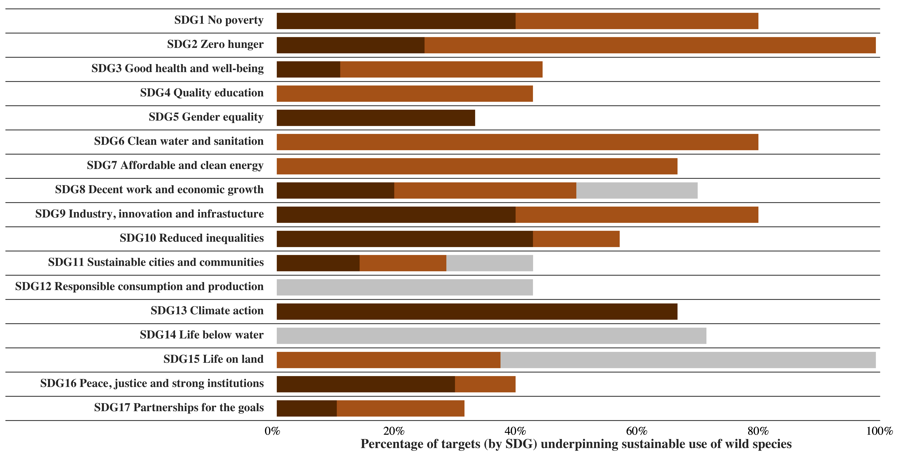

## IPBES Sustainable Use of Wild Species Assessment - Summary for policymakers - Data management report for Figure SPM.2

This repository contains the code to reproduce the Figure SPM.2 of the **IPBES Sustainable Use of Wild Species Assessment**. This figure shows the percentage of Sustainable Development Goals (SDG) targets underpinning the sustainable use of wild species (https://zenodo.org/record/7009891).

## Usage

First clone this repository, then open the R script `make.R` and run it.
This script will read data stored in the folder `data/` and export the figure
in the folder `figures/`.

## License

This work is licensed under 
[Creative Commons Attribution 4.0 International](https://choosealicense.com/licenses/cc-by-4.0/).

Please cite this work as:

> Fromentin, Jean-Marc, Emery, Marla, Donaldson, John, Danner, Marie-Claire, Agnès Hallosserie, Kieling, Daniel, Balachander, Ganesan, Barron, Elizabeth, Casajus, Nicolas, Chaudhary, Ram Prasad, Gasalla, Maria, Halmy, Marwa, Hicks, Christina, Parlee, Brenda, Park, Mi Sun, Rice, Jake, Ticktin, Tamara, & Tittensor, Derek. (2022). IPBES Sustainable Use of Wild Species Assessment - Summary for policymakers - Data management report for Figure SPM.2. Zenodo. https://doi.org/10.5281/zenodo.7009891.
