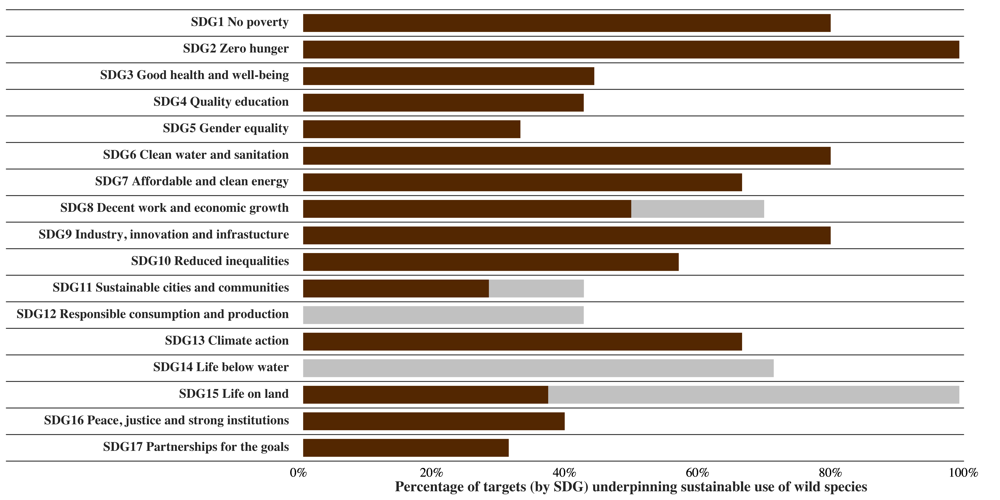

# IPBES Sustainable Use Assessment - Figure SPM.1

This repository contains the code to reproduce the Figure SPM.1 of the 
**IPBES Sustainable Use Assessment**. This figure shows the percentage of 
Sustainable Development Goals (SDG) targets underpinning the sustainable use 
of wild species.

## Usage

First clone this repository, then open the R script `make.R` and run it.
This script will read data stored in the folder `data/` and export the figure
in the folder `figures/`.

## License

This work is licensed under 
[Creative Commons Attribution 4.0 International](https://choosealicense.com/licenses/cc-by-4.0/).

Please cite this work as: [...]

